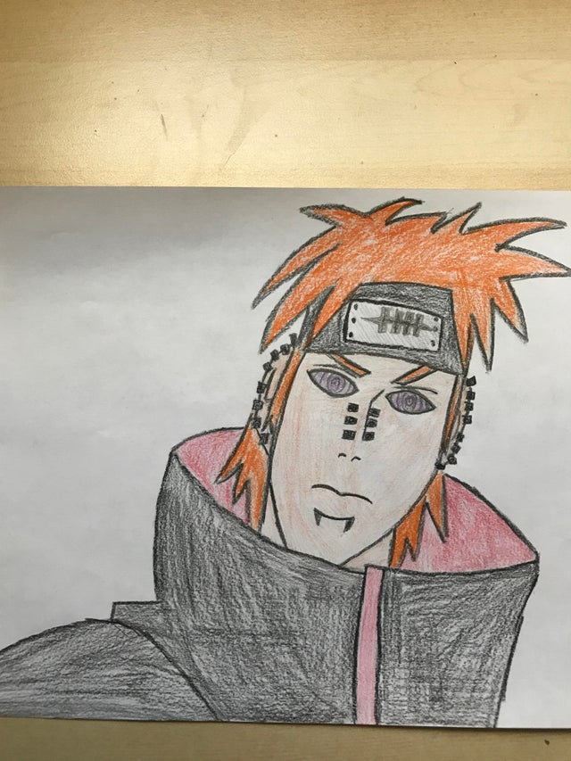

# Introduction to Computer Science

In this repository you will find my academic works in JavaScript, HTML and CSS

List of projects:
1. p5.js interactive applications
2. Arduino Fabbots
3. Leaderboad for Project 1
4. REST API 
5. IoT 

***

***
